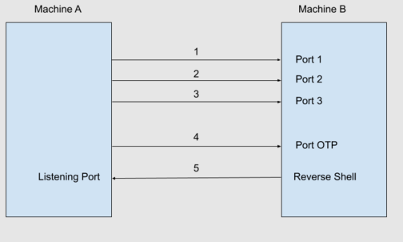

# Python Port Knocking

- This code was made with the purpose to practice things that I have studied recently about python programming and security:
    - socket library: a socket is an endpoint of a communication between two programs running on a network. Sockets are used to create a connection between a client program and a server program. Python's socket module provides an interface to the Berkeley sockets API.
    - Port Knocking: is a stealth method to externally open ports that, by default, are closed. It works by requiring connection attempts to a series of predefined closed ports. With a simple port knocking method, when the correct sequence of port "knocks" (connection attempts) is received, certain port(s) are open to allow a connection. For its implementation, Pypacker will be used.
    - One-time Password (OTP): is a string of characters or numbers that authenticates a user for a single login attempt or transaction. An algorithm generates a unique value for each one-time password by factoring in contextual information, like time-based data or previous login events. PyOTP will be used to implement a Time-based One-time Password.
    - Reverse shell: A reverse shell is a shell session established on a connection that is initiated from a remote machine.

- Since this is an alternative way of accessing a system ignoring authentication methods, this code can be used as a form of backdoor, with the characteristic that no port is left open (only after port knocking), making detection more difficult during routine scans.

## Flowchart

  

- 1,2,3: Port Knocking. After connecting to specific ports (default 1337, 1338, 1339) in order and within a timeout between connections (standard 5s), the OTP port will be opened.
- 4: Verify OTP. By default, OTP password is sent to port 1340.
- 5: Return a shell. By default, shell is sent to port 12345.

## Usage

0. Before, make sure you have the necessary libraries installed: 
    > `pip install -r requirements.txt`  

1. Let's use netcat to listen on a port that will soon receive the shell:
    > `nc -vlp 12345`

2. On another terminal configure and execute the script. Customize the base32 Secret Key:
    > `python -c "import pyotp; print(pyotp.random_base32())"`  
Replace the base32 Secret Key hardcoded in the script with the newly generated value. You can customize the parameters ports_list, timeout, port_otp and port_reverse_shell in the script. Execute the script:  
    > `sudo python script.py`

3. Open one more terminal to perform the Port Knocking:
    > `nc <remote_machine> 1337`  
    > `nc <remote_machine> 1338`  
    > `nc <remote_machine> 1339`  
Of course you can simply run in localhost. Port 1340 will now be open.

4. Getting the current OTP password:
    > `python -c "import pyotp; print(pyotp.TOTP('your_base32_Secret_Key').now())"`

5. Send the OTP password to the newly opened port 1340:  
    > `echo "<otp_password>" | nc <remote_machine> 1340`  
Your listening port will receive the remote shell.
